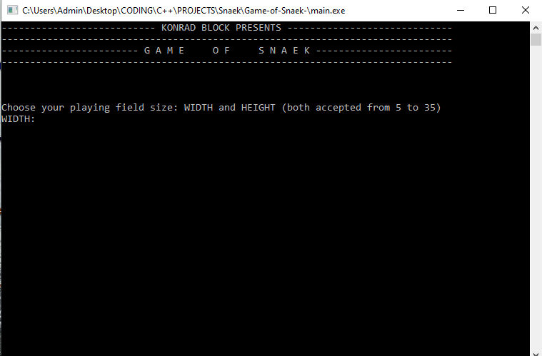
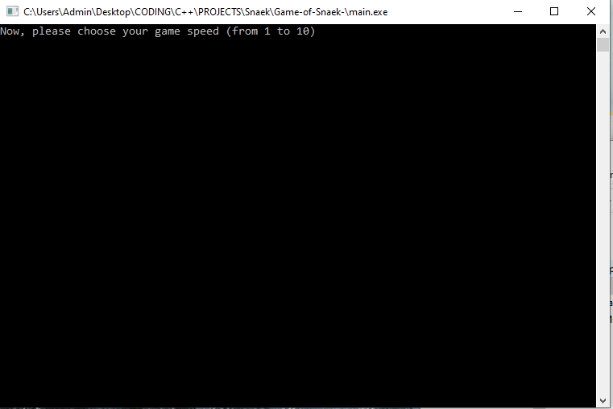
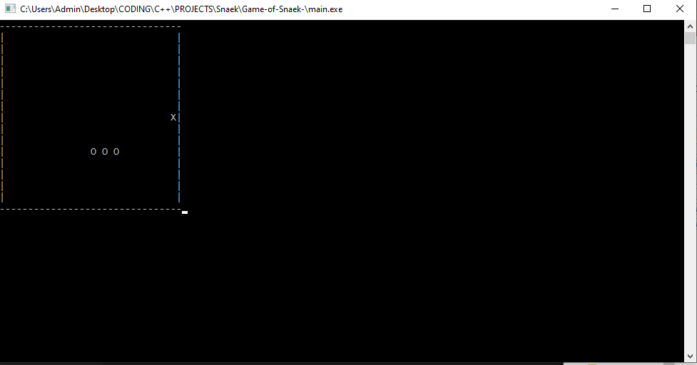

# Game of "Snaek"

My first personal take at well-known and beloved "Snake" game. Made as an coding excercise :) 
Control your snake with arrows, collect food to grow and try to not eat your own tail!

## Language
Plain C++ with some C libraries assistance.

## Platform
Windows-only console application.

## Changelog
v0.1 ----->  First functional build. 20.11.2022

## TO CHANGE
- Change position tracking arrays into queues to save memory and to discard useless data after time. 

## TO FIX
- Fix border collision check to properly change snake's position once map border is reached.
- It's possible to phase out of map while approaching upper or lower map border.  
 
## MEDIUM MAP SIZE IS RECOMMENDED. GAME CAN GET BUGGY AT VERY SMALL MAPS. MAP DRAWER DOESN'T WORK WELL WITH VERY BIG MAPS AND SLOW GAME SPEEDS. 
## MAP DRAWER DOESN'T WORK VERY WELL WITH VERY BIG MAPS AND SLOW GAME SPEEDS. 

## Screenshots 

